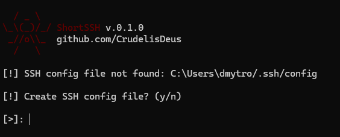
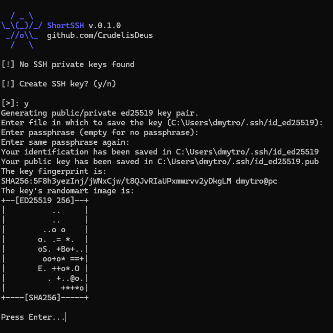
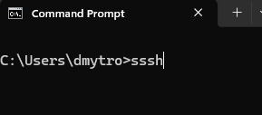
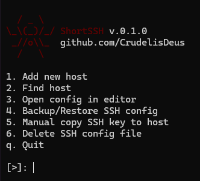
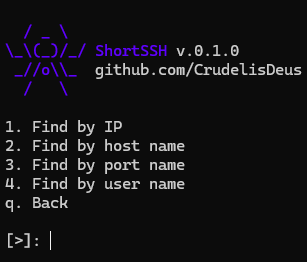
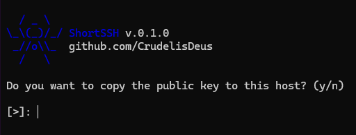
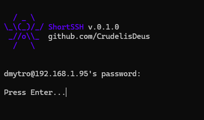
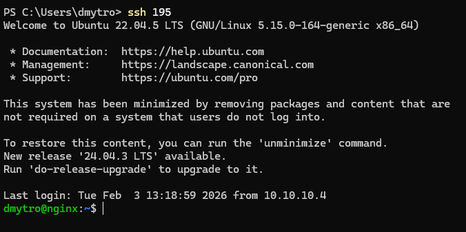

<div align="center">


<p>ShortSSH is your personal SSH manager in the terminal. It simplifiesworking with SSH hosts, keys, and configuration, removing the hassle andmistakes of manual setup.</p>


<table>
    <thead>
        <tr>
            <th>№</th>
            <th>Example</th>
            <th>Standart command</th>
            <th>ShortSSH</th>
        </tr>
    </thead>
    <tbody>
        <tr>
            <td>1</td>
            <td>ssh connect</td>
            <td>ssh -p 22 dmytro@192.168.1.112</td>
            <td>ssh 1112</td>
        </tr>
        <tr>
            <td>2</td>
            <td>rsync</td>
            <td>rsync rvu ./* -e "ssh -p 53" dmytro@192.168.1.112:/home</td>
            <td>rsync rvu ./* 1112:/home</td>
        </tr>
        <tr>
            <td>3</td>
            <td>ssh -L</td>
            <td>ssh -i id_ed25519 -L 5555:localhost:5432 ubuntu@127.0.0.1</td>
            <td>ssh dev</td>
        </tr>
    </tbody>
</table>

<h2>Automatic config and key creation</h2>

<table >
  <tr>
    <th >~/.ssh/config</th>
    <th>~/.ssh/key</th>
  </tr>
  <tr>
    <td align="center">
      <a href="https://shortssh.deus-soft.org/shortssh.exe">
        
      </a>
    </td>
    <td align="center">
      <a href="https://shortssh.deus-soft.org/shortssh.exe">
        
      </a>
    </td>
  </tr>
  <tr>
    <td align="center">
      <a href="https://shortssh.deus-soft.org/shortssh.exe">
        
      </a>
    </td>
    <td align="center">
      <a href="https://shortssh.deus-soft.org/shortssh.exe">
        
      </a>
    </td>
  </tr>
</table>

<h2>Lightweight config manager</h2>

<table>
  <thead>
    <tr>
      <th align="center">Run manager</th>
      <th align="center">Add / Edit / Delete hosts</th>
      <th align="center">Search</th>
    </tr>
  </thead>

  <tbody>
    <tr>
      <td align="center">
        
      </td>
      <td align="center">
        
      </td>
      <td align="center">
        
      </td>
    </tr>
  </tbody>
</table>

<h2>Copy public keys to server after adding</h2>

<table>
  <thead>
    <tr>
      <th align="center">Run manager</th>
      <th align="center">Add / Edit / Delete hosts</th>
      <th align="center">Search</th>
    </tr>
  </thead>

  <tbody>
    <tr>
      <td align="center">
        
      </td>
      <td align="center">
        
      </td>
      <td align="center">
        
      </td>
    </tr>
  </tbody>
</table>


<h2>Windows download</h2>

<table>
    <thead>
        <tr>
            <th>Name</th>
            <th>Release</th>
            <th>Dev</th>
        </tr>
    </thead>
    <tbody>
        <tr>
            <td>Release link</td>
            <td>https://shortssh.deus-soft.org/shortssh.exe</td>
            <td>https://shortssh.deus-soft.org/dev-shortssh.exe</td>
        </tr>
    </tbody>
</table>

</div>

`powershell | Update / Install`
```bash
Invoke-WebRequest `
"https://raw.githubusercontent.com/CrudelisDeus/ShortSSH/main/install.bat" `
-OutFile "$env:USERPROFILE\Downloads\ShortSSH-install.bat"
```

```bash
cd $env:USERPROFILE\Downloads
.\ShortSSH-install.bat
```

`powershell / cmd | run manager`
```bash
sssh
```

<h2>Linux download</h2>

```bash
sudo curl -L https://shortssh.deus-soft.org/shortssh.py -o /usr/local/bin/sssh
sudo chmod +x /usr/local/bin/sssh
```
