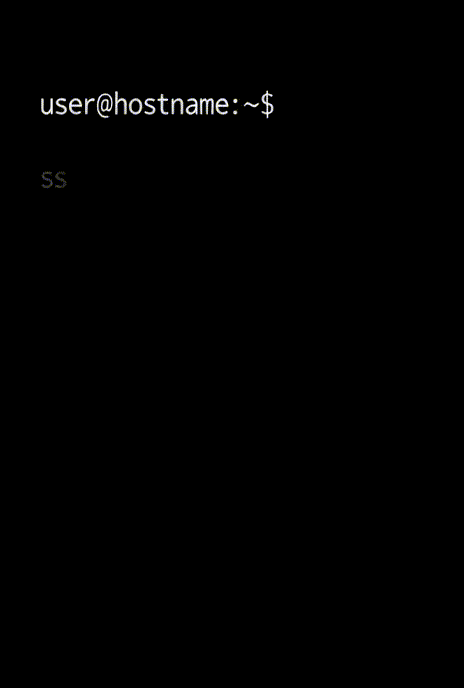

<div align="center">
  <h1>ShortSSH</h1>

  

  <p>ShortSSH is your personal SSH manager in the terminal. It simplifies working with SSH hosts, keys, and configuration, removing the hassle and mistakes of manual setup.</p>
  
</div>


## Example use

`(manual routine)`
```bash
ssh root@192.168.1.42 -p 2222 -i ~/.ssh/id_ed25519_server
```


## Windows download

- release: https://shortssh.deus-soft.org/shortssh.exe
- dev: https://shortssh.deus-soft.org/dev-shortssh.exe

### Use installer

`download bat`
```bash
Invoke-WebRequest `
"https://raw.githubusercontent.com/CrudelisDeus/ShortSSH/main/install.bat" `
-OutFile "$env:USERPROFILE\Downloads\ShortSSH-install.bat"
```
`install`
```bash
cd $env:USERPROFILE\Downloads
.\ShortSSH-install.bat
```
